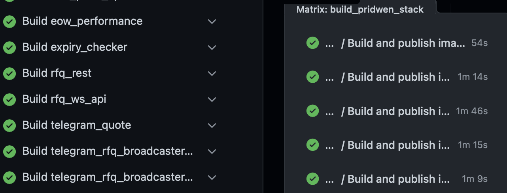

# Use reusable workflows to push images on GitHub Actions

Most applications are composed of many services and it may lead to hundreds or thousands of
GitHub actions lines to manage everything.

This post explains how [reusable workflows](https://docs.github.com/en/actions/using-workflows/reusing-workflows) 
and [matrix](https://docs.github.com/en/actions/using-jobs/using-a-matrix-for-your-jobs) can reduce 
GitHub actions yaml to only few lines without any duplications.

## Context

Let's begin with a bit of context to understand why and when the usage of reusable workflows can be useful.

Here's a list of exhaustive reasons:
- You have some duplications in your actions, for instance when you want to build and push your application's
services on a registry (like Docker Hub, GitHub registry...)
- You identify common pattern, setup or steps in your CI, this could be setup step or whole processes where
the only difference can be abstract with variables. For instance, you have same steps but in different directories.
- You are working on a project with a lot of services that need to be tested, packaged and deployed online.

If you can recognize one of your project, this blog post is written for you!

For this project, I will use a real case that I met for one of my client: [Pridwen](https://www.pridwen.fi).
This project is a financial tool composed of multiple services, some are fetching data, there is 2 REST API, a Websocket
services, telegrams bots and also additional utilities processes for backup, observabilities, update and analysis.

In total, there are 10 Python services that need to be packaged so it can be deployed on an VPS.
All these services have common deployment processes, they are packaged into [Docker images](https://jfrog.com/knowledge-base/a-beginners-guide-to-understanding-and-building-docker-images/)
and then ran as services through a [docker compose](https://docs.docker.com/compose/).

As well, before doing a release in production, changes are deployed in a development environment.
Which means images are built many times and with different time depending on the stage.

The schema below shows the development and production release process. Each push on master updates
the development stage and there is a manual workflow to release the stack in production.


Indeed, each service has its own Dockerfile, since all services share common dependencies,
these Dockerfile are located at the root of the repository as shown below:

```shell
ls | grep ".Dockerfile"
# auto_quoter.Dockerfile
# backend.Dockerfile
# eod_price_update.Dockerfile
# eod_price_update_manual.Dockerfile
# eow_performance.Dockerfile
# expiry_checker.Dockerfile
# rfq_rest.Dockerfile
# rfq_ws_api.Dockerfile
# telegram_quote.Dockerfile
# telegram_rfq_broadcaster_derivatives.Dockerfile
# telegram_rfq_broadcaster_spot.Dockerfile
```

All those processes could lead to thousands of YAML lines, which would be so painful to write and maintain.
But GitHub shipped a recent feature to fix this issue: reusable workflows.

## Create a reusable workflow

The main pain point in the project was to build and push image to a registry.

The common action is the following:

```yaml
jobs:
  build_publish:
    name: Build and publish image
    runs-on: ubuntu-latest

    steps:
      - name: Checkout repository.
        uses: actions/checkout@v3
  
      - name: "Setup Docker Buildx"
        uses: docker/setup-buildx-action@v1
  
      - name: "Login to Registry"
        uses: docker/login-action@v2
        with:
          registry: <registry>
          username: <username>
          password: <password> # Stored as secret in GH environment
  
      - name: Build & push image
        uses: docker/build-push-action@v4
        with:
          context: <context of the build>
          file: <dockerfile path>
          push: true
          tags: |
            <registry address>/<repo>/<service_name>:<version tag>
```

As you see, this is a lot of steps, which are basically the same no matter the service nor the language.
You just need to pick up the write context and Dockerfile to push it to a registry.

This is a typical situation where a reusable workflow could be useful.
Before writing it, let's identify which values are dynamic and shall be abstract as variable:
1. The context of the build, you may have your Dockerfile into different folders. Or for clarity purpose, 
you may want to explicitly set the context.
2. The Dockerfile path, indeed because you may have multiple Dockerfile in your path or you simplify named them
differently than `Dockerfile`.
3. The service name in the tag, because you want to push each services with a different image name.
4. The version tag, since you may want to push `dev`, `latest` or specific versions like `v1.0.0`.

⚠️ Unfortunately, reusable workflows cannot access GitHub environment or secrets so we also need to add
an extra variable to forward the registry password to the workflow.

We know our common steps and dynamic variable, let's create this reusable workflow.

Let's create a new file `build-push-image-reusable-workflow.yml`.

```shell
# Go into workflows directory
cd .github/workflows

# Create new file
touch build-push-image-reusable-workflow.yml
```

Then let's write the workflow:

```yml
# No name since it is not an Action by itself.

on:
  # Special GitHub trigger to specify a reusable workflow
  workflow_call:
    # Define secrets into secrets key
    secrets:
      REGISTRY_TOKEN:  # Define REGISTRY_TOKEN variable
        required: true # Set as required

    # Define classic input (not hidden in CI)
    inputs:        
      app:                              # Define app variable
        type: string                    # Set type as string
        description: Application name   # Set description
        required: true                  # Set as required

      tag:
        type: string
        description: Tag to give to the built image
        required: true

      context:
        type: string
        description: Context to use on the build
        required: false                           # Set as optional
        default: '.'                              # Set default value to .

      dockerfile:
        type: string
        description: Dockerfile to use to built the image
        required: false
        default: 'Dockerfile'

# Define reusable job
jobs:
  build_publish:
    name: Build and publish image # Specify job's name
    runs-on: ubuntu-latest        # Run on Ubuntu runner

    steps:
      - name: Checkout repository.
        uses: actions/checkout@v3
  
      - name: "Setup Docker Buildx"
        uses: docker/setup-buildx-action@v1
  
      - name: "Login to GitHub Registry"
        uses: docker/login-action@v2
        with:
          registry: <registry address>
          username: <username>
          password: ${{ secrets.REGISTRY_TOKEN }} # Use secret arguments through secrets.<variable name>
  
      - name: Build & Push image
        uses: docker/build-push-action@v4
        with:
          context: ${{ inputs.context }} # Use input as inputs.<variable names>
          file: ${{ inputs.dockerfile }}
          push: true
          tags: |
            <registry address>/<repository>/${{ inputs.app }}:${{ inputs.tag }}
```

The reusable workflow is ready, let's use it with a matrix!

---

💡To get more information about reusable workflows capabilities, have a look at the [official documentation](https://docs.github.com/en/actions/using-workflows/workflow-syntax-for-github-actions#onworkflow_call).

---

## Use the workflow with matrix

First, what is a GitHub action matrix and why using it?

The matrix is a special field in the GitHub Action that will define different values that will
then be inserted into a same job so GitHub can execute them in parallel.
This is useful to gain time but also avoid duplication, specially in combination with reusable workflow.

To make the usage of matrix possible, I reduced the number of dynamic variable to the minimum.
In our case, only the name of the Dockerfile may be set.

Let's write a file to push images in development stage.

```shell
# Create new file
touch dev_cd.yml
```

And inserts the following content to build and push our 10 services.

```yml
name: Build and push services to registry in dev stage.

on:
  push:
    branches: [master] # Update dev on push on main

jobs:
  build-push-services:
    strategy:
      matrix:
        # Create service key with list of each services.
        service: 
        - backend
        - rfq_rest
        - rfq_ws_api
        - telegram_quote
        - telegram_rfq_broadcaster_derivatives
        - telegram_rfq_broadcaster_spot
        - auto_quoter
        - expiry_checker
        - eod_price_update
        - eow_performance
    name: Build ${{ matrix.service }} # Name workflow with the service processed.
    # Select the reusable workflow directly in your GH repository
    # You may update the @main to any branch you want to test the workflow
    # and then update it to main after merge.
    uses: <gh organisation>/<repository>/.github/workflows/build-publish-workflows.yml@main
    # Forward secret using secrets field.
    secrets:
      REGISTRY_TOKEN: ${{ secrets.REGISTRY_TOKEN }}
    # Set input using with field
    with:
      app: ${{ matrix.service }}                   # Service built
      tag: dev                                     # Set image tag as dev
      dockerfile: ${{ matrix.service }}.Dockerfile # Dockerfile to use
```

Here is an example of the action running on Pridwen. You might get similar update with more or less services.



I hope this article was useful! As a DevOps, it's always painful to see complex and mystic CI/CD, I wish this
article showed another way to do things to have easy and efficient processes.

Feel free to reach me out or comment if you have any question 🚀

Written by [Vasek - Tom C.](https://twitter.com/TheRealVasek) for [Quartz](https://twitter.com/qu3rtz).
