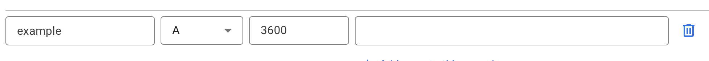

# Setup HTTPS with NGINX and Certbot

During the deployment of a new application, it is common to make the application
accessible through a [domain name](https://www.cloudflare.com/en-gb/learning/dns/glossary/what-is-a-domain-name/).

This is a simple step, really satisfying, but I used to struggle a bit when I started to
do it for my first client.

Project architecture are usually the same, you got a proxy like NGINX that will
take care of the redirection to your application(s).
As security measure you setup a firewall and open port `80` and `443` to allow traffic on HTTP and HTTPS.


And then it comes to set up HTTPS, and questions like "should I expose my application before enabling HTTPS?", 
"how do I just do that?", "wait, where do I store those configuration files?".

This article targets beginners who want a simple and fast way to set HTTPS on any application
deployed on a VPS.

## Why set up HTTPS?

A bit of theory before starting, why is it important to set up HTTPS on your application?

Basically, HTTPS adds a security layer around HTTP protocol thanks to TLS encryption.
When a request is sent with HTTPS, it hides the content of the request, so it cannot be
intercepted and used by an attacker.

Here is a [great article from CloudFlare](https://www.cloudflare.com/en-gb/learning/ssl/why-use-https/) for the most curious.

## Set up VPS environment

For this article, I'll use a basic VPS with Ubuntu as operating system and the domain name
`example.vasek.technology`.

To begin, we need to install [Nginx](https://www.cloudflare.com/en-gb/learning/ssl/why-use-https/)
and [Certbot](https://certbot.eff.org).

Nginx is a powerful tool for web serving. We will use it to catch requests sent to
the domain name and redirect them to the application.
Certbot is a simple CLI to set HTTPS on a server.

You do not need to set up your application to enable HTTPS, you can do that later.

Let's install Nginx.

```shell
# Update apt dependencies
sudo apt update

# Install Nginx
sudo apt install nginx -y
```

This will automatically set up Nginx as a service in your VPS so it will be automatically restart
if you shut down your VPS and start it later.

You can verify that Nginx is correctly configured with `sudo systemctl status nginx`.


You should also see a new folder in `etc/nginx` containing a lot of files and folders.
Let's not pay attention to them for now.

```shell
conf.d          koi-utf     modules-available  proxy_params     sites-enabled  win-utf
fastcgi.conf    koi-win     modules-enabled    scgi_params      snippets
fastcgi_params  mime.types  nginx.conf         sites-available  uwsgi_params
```

If you go to your IP address on your web browser, you should also see the default
Nginx welcome page.


Let's now install Certbot, to do so we will need Python.

```shell
# Install python3
sudo apt install python3 python3-venv libaugeas0

# Set up a virtual environment to not conflict with our local one
sudo python3 -m venv /opt/certbot/

# Install pip in this environment
sudo /opt/certbot/bin/pip install --upgrade pip

# Install Certbot with nginx plugin
sudo /opt/certbot/bin/pip install certbot certbot-nginx

# Create a symbolic link to access use certbot from anywhere
sudo ln -s /opt/certbot/bin/certbot /usr/bin/certbot

# Verify certbot is installed
certbot --version
# certbot 2.3.0
```

## Link domain name to VPS IP

It is time to link your domain name to the VPS IP, so you can access the page from
it.

I personally use Google Domain but any domain name manager works.
Let's create a [A record](https://support.dnsimple.com/articles/a-record/) that points to your VPS IP.



After few minutes, you should be able to access your website on this domain name.


But as you see, it is still written as not secure. Let's fix that!

## Set up basic Nginx configuration

Create a new file `nginx.conf` anywhere in your VPS and add the most basic
configuration that will simply serve the welcome page.
We will set up a symbolic link later to let Nginx use it.

```nginx
server {
	# Listen on HTTP port (80)
	listen 80;

	# Serve Nginx welcome page
	root /var/www/html;

	# Set domain name to serve.
	server_name example.vasek.technlogy www.example.vasek.technology;
}
```

Now we need two last thing.

First, the default index.html page in `/var/www/html` may not be named properly.
By default, Nginx will look for `index.html`.

In my case, it is always named `index.nginx-debian.html`, let's rename it
to `index.html`

```shell
# Check for files in /var/www/html
ls /var/www/html
# index.nginx-debian.html

# Rename it to index.html
mv /var/www/html/index.nginx-debian.html /var/www/html/index.html
```

Secondly, Nginx will process every config files located in `/etc/nginx/sites-enabled`.
I usually prefer to create a symbolic link to that location, so I can maintain it
from my git repository. So others can review it and if it is simpler if I want to change
my VPS.

```shell
# Create a symbolic link. Make sure to use an absolute path to your nginx config
# file using $PWD variable
ln -s "$PWD/nginx.conf" /etc/nginx/sites-enabled/nginx.conf 

# Show the file to verify the symbolic link has been correctly done.
cat /etc/nginx/sites-enabled/nginx.conf 
server {
	# Listen on HTTP port (80)
	listen 80;
    listen [::]:80;
	
	# Serve Nginx welcome page
	root /var/www/html;

	# Set domain name to serve.
	server_name example.vasek.technology www.example.vasek.technology;
}
```

You can also remove the default configure

```shell
rm /etc/nginx/sites-enabled/default
```

Let's verify that our config is correct.

```shell
nginx -t
# nginx: the configuration file /etc/nginx/nginx.conf syntax is ok
# nginx: configuration file /etc/nginx/nginx.conf test is successful
```

It is normal if you do not see your file in the log, the main config is in
`/etc/nginx/nginx.conf` and includes any files in `/etc/nginx/sites-enabled`

Now we can reload nginx to apply new configuration.

```shell
nginx -s reload
```

Let's verify if the nginx still serve the welcome page on our domain name


## Use Certbot to enable HTTPS

It is time set up HTTPS on our domain name. Let's run Certbot.

```shell
# Generate SSL certificate using certbot.
certbot --nginx -d example.vasek.technology --email tom@quartz.technology
```

Note that the `--email` is an important option, you should provide a valid 
address email that will stay in time. This email is used as proof of ownership
and is used by site like [Whois](https://whois.domaintools.com) to record all
domain names and their owner.

If you take a look at your `nginx.conf`, you will see a lot of changes.

```nginx
server {	
	# Serve Nginx welcome page
	root /var/www/html;

	# Set domain name to serve.
	server_name example.vasek.technology www.example.vasek.technology;

    listen [::]:443 ssl ipv6only=on; # managed by Certbot
    listen 443 ssl; # managed by Certbot
    ssl_certificate /etc/letsencrypt/live/example.vasek.technology-0001/fullchain.pem; # managed by Certbot
    ssl_certificate_key /etc/letsencrypt/live/example.vasek.technology-0001/privkey.pem; # managed by Certbot
    include /etc/letsencrypt/options-ssl-nginx.conf; # managed by Certbot
    ssl_dhparam /etc/letsencrypt/ssl-dhparams.pem; # managed by Certbot

}
server {
    # Redirect HTTP to HTTPS
    if ($host = example.vasek.technology) {
        return 301 https://$host$request_uri;
    } # managed by Certbot


	listen 80;
	listen [::]:80;
	server_name example.vasek.technology www.example.vasek.technology;
    return 404; # managed by Certbot
}
```

The file has been updated by Certbot to serve HTTPS on your dns and also redirect
HTTP traffic to HTTPS.
It may be a bit messy so clean extra spaces and reorder tabs if necessary.

You can go back on your domain name and see that HTTPS is now enable.


Congratulation! You can now update your configuration to serve your application
after deploying it on your VPS.

For example

```nginx
	# Serve Nginx welcome page
	# Replaced by location
	# root /var/www/html;
	
	
	# Redirect request to application listening on
	# port 3000 in the VPS.
	location / {
	    proxy_pass http://localhost:3000;
	}
```

I hope this article was useful to you! I remember my first time struggling to add HTTPS on
my first application with 10 different tabs opened about Nginx and its obscure configuration.

Feel free to reach me out or comment if you have any question 🚀

Written by [Vasek - Tom C.](https://twitter.com/TheRealVasek) for [Quartz](https://twitter.com/qu3rtz).